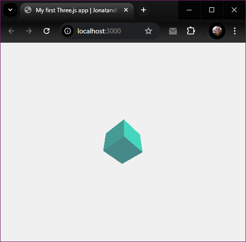

# Three JS - Basic examples

### Useful Links:
 - Three JS Hompeage: https://threejs.org/
   - Creating a scene: https://threejs.org/docs/index.html#manual/en/introduction/Creating-a-scene
   - Orbit Controls: https://threejs.org/docs/index.html#examples/en/controls/OrbitControls
 - React-three-fiber homepage: https://r3f.docs.pmnd.rs/getting-started/introduction
 - Drei, A growing collection of useful helpers for @react-three/fiber: https://drei.docs.pmnd.rs/getting-started/introduction
---

### Using ThreeJS from CDN:

- [Sample code](/basic/)

### Vanilla Javascript project with Vite:

- [Sample code](/vite/)

### Using @react-three/fiber and @react-three/drei:

- [Sample code](/vite-react/)